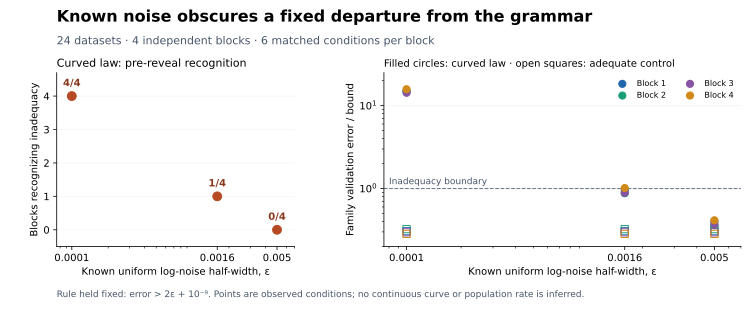

# Misspecification detection margin — NP-MISSPEC-MARGIN-01, revision 1

**MISSPEC_MARGIN_1_COMPLETE — PROVISIONAL — INDEPENDENT AUDIT PENDING.**

The fixed rule recognized the curved law as inadequate in **4/4, 1/4, and 0/4 blocks** as the known generated noise increased. All twelve adequate controls were retained and received structural recovery credit. Seven curved-law cases became stable selections; every one was correctly denied structural credit. Completion means the frozen study produced an interpretable boundary measurement, irrespective of favorable detector performance.

| Actual generated log-noise half-width ε | Curvature recognized | Curvature missed | Wrong stable selections | Adequate controls rejected | Curved family validation error range |
|---:|---:|---:|---:|---:|---:|
| 0.0001 | 4/4 | 0/4 | 0/4 | 0/4 | 0.00286004–0.00315768 |
| 0.0016 | 1/4 | 3/4 | 3/4 | 0/4 | 0.00280420–0.00324403 |
| 0.005 | 0/4 | 4/4 | 4/4 | 0/4 | 0.00360821–0.00414041 |

These are counts across four independent random blocks with fixed exponent strata. The six law/noise conditions within each block are matched. They are **not 24 independent replicates**, a population false-positive rate, or confidence bounds on arbitrary-data performance.

## What was measured

The adequate law is

\[
y=kxt^{-2}z^p\exp(e),\qquad e\in[-\epsilon,\epsilon].
\]

The curved condition multiplies the clean response by \(\exp[0.01(\log z)^2]\). Here \(z\) is dimensionless. Its nonzero second derivative with respect to \(\log z\) excludes it from the fixed monomial grammar. The same coefficient, features and normalized row-noise draws are shared across six conditions within each block; only the law condition and the actual noise multiplier change. Block exponents are fixed at −2, −1, 1 and 2, respectively, addressing FH-20 without random collisions or rerolls.

The unchanged internal engine exhaustively enumerated five eligible classes per dataset. It fitted each coefficient on 64 training rows, ranked using 48 validation rows and the frozen complexity penalty, and sealed decisions before truth and 64 held-out rows per dataset reached the evaluator. There are 4,224 rows across 24 datasets, with intentional within-block dependence and exact feature measurements.

The primary decision remains

\[
r_{\rm family}>2\epsilon+10^{-9}.
\]

Here \(r_{\rm family}\) is the smallest raw validation log-RMSE over all eligible classes using their sealed training coefficients. Equality is adequate. The rank-1 stability decision is retained separately. All new metrics derive from the frozen policy, with deliberately different-value fixtures guarding against copied constants.

The choice of noise levels was informed by accepted Suite 1 residuals and an analytic population approximation, disclosed before generation. Thus **global outcome_blind=false**, while new realized outcomes were unseen at design/source freeze. The worker received sanitized train/validation data and policy only. Designer family knowledge remains; hostile-code isolation is not claimed. Fresh precommitted streams separate blocks and splits; there was no seed replacement, outcome-driven exclusion, refit, criterion change, or extra dataset.

## Observed boundary and what it means

Blocks 1–3 recognized inadequacy at ε = 0.0001 and did not at 0.0016. Block 4 still recognized it at 0.0016 and did not at 0.005. These sampled changes locate a **coarse transition**, not an exact continuous crossing. No recognition reversal occurred across the three sampled noise levels. Validation residuals themselves decreased from low to middle noise in blocks 2 and 3 because matching permits noise–curvature cross terms; monotonic residuals were neither assumed nor required.

All twelve curved cases passed the broad 0.04 validation/held-out approximation tolerances and received **zero structural credit**. At middle noise, all four curved rank-1 held-out errors (0.00492933–0.00566851) exceeded the 0.003200001 adequacy bound, even though three pre-reveal validation decisions were stable. Held-out evidence did not rescue or rewrite those sealed decisions. At high noise all four passed the looser known-noise adequacy bound while remaining structurally wrong by the oracle.

Zero family rejection in adequate controls has a specific mathematical explanation. With exact features, the true monomial present, and bounded uniform log noise, training fits shift the log coefficient by the mean training noise. Any validation residual for that true class is bounded by \(2\epsilon\). Thus the family contains an adequate member under these assumptions; this is principally a construction and implementation check, not an estimated general specificity. Rank-1 behavior is a separate finite-data observation.

Unknown or estimated noise, feature errors, other departure strengths, other noise laws, broader grammars and external engines remain unmeasured. Finite-data inadequacy alone does not identify its unique cause in real observations. The controlled generator supplies that causal label here. Nothing establishes unknown-natural-law discovery or empirical support for a Number Project physical hypothesis.

## Retrospective Suite 1 supplement — fixed observations only

For each of the 24 accepted Suite 1 realizations, [retrospective.json](../Experiments/SymbolicDiscovery/MisspecificationMargin1/retrospective.json) reports original noise, family and rank-1 errors, adequacy bounds, critical assumed noise, dimensionless margins where defined, and explicit counterfactual judgments. Every necessary source is pinned in [retrospective_sources.json](../Experiments/SymbolicDiscovery/MisspecificationMargin1/retrospective_sources.json). No old world was regenerated, no coefficient refitted and no discovery rerun for this diagnosis.

\[
\epsilon_{\rm critical}=(r_{\rm family}-\delta)/m.
\]

| Accepted Suite 1 cell | Original ε | Critical assumed ε, across its four stored realizations | Critical/original noise |
|---|---:|---:|---:|
| Curvature | 0.0001 | 0.001254204–0.001627744 | 12.542–16.277 |
| Fractional power | 0.005 | 0.133717719–0.145720147 | 26.744–29.144 |

At assumed ε = 0.005, all four *unchanged* Suite 1 curvature records count as adequate. This is threshold sensitivity on stored observations, **not regenerated higher-noise evidence**. Nonpositive critical values have no nonnegative inadequacy interval; ratios at original ε = 0 are explicitly null. Rank-1 critical values differ from the family minimum in two nuisance cases and one fractional-power case and are reported separately.

This forward explanation addresses DM-093's quantitative presentation gap. Claude retains closure authority. The original Suite 1 report and all old evidence remain unchanged. Suite 1 was independently accepted at `e0c018923c799c41870cb1c11eef7d1f6b5741ba` and truly merged at `0420b0cadc2019b8497556c8bacd9c93bf5e39c1`; its old pending navigation is historical. Benchmark 0's raw FAIL and accepted reconciliation PASS, and Suite 1's raw PASS plus preserved export failure and accepted reconciliation, remain distinct in the authoritative routes.

## Immutable execution and operational qualification

| Stage | Commit or external anchor |
|---|---|
| Consumed work order and launch receipt | `8a4e9a6879603a7f0f4fcc4948f92d578699fd5d` |
| Sole-file design freeze | `197433b37e36938c597d2a820905fe6c71226b07` |
| GitHub draft PR #57 created | **2026-09-15T14:41:08Z** |
| Frozen generator/evaluator/custody and preflight | `b81278440db1c1b234caca26f98bf91162bcfb52` |
| Sole-file seed commitment, remotely published before generation | `6678a82593a821cd56b095faab3bf0cc4fb7c966` |
| All public observations and private hashes | `884bf4a26fb0cb9ee01d3916e89ec92a6142ae59` |
| All selections sealed | `59a6bde5d5691df5be5a68f35295cfbe02bd1199` |
| Oracle/held-out reveal and raw COMPLETE | `a9ab67b3baf3d40d461300ba7539cecd07b7d715` |
| Detached verifier source and retained failed check | `ff37912ec30b2d36e99bd8094cfa5a1a62dd55be` |

The exact consumed revision is preserved as 16,781 UTF-8 bytes, SHA-256 `57b2270673e179f183103eb3ab8aceaaa26704cf49da039d9aaeaa0a17001cab`. Its Drive file/revision identifiers and modification time are in the launch receipt. True merge ancestry is essential; **never squash or rebase**.

Before target generation, 23 affected tests passed and eight new production-source mutations were killed by assertions. The first wrong-credit mutant raised a TypeError before its intended assertion; that failed calibration is retained in `mutation_preflight.attempt1.json`. Only that mutation was recalibrated, reusing seven successful cases at unchanged source bytes. There was no target realization involved.

The first read-only post-result check failed at an overly broad schema comparison: the summary uses `tnp-margin1/summary-v1`, while its raw-result envelope deliberately uses `tnp-margin1/raw-result-v1`. The preceding metric/control comparisons had matched. [verification_failure.json](../Experiments/SymbolicDiscovery/MisspecificationMargin1/verification_failure.json) preserves the traceback. The frozen checker remains unchanged. The detached verifier checks each schema explicitly and requires exact equality of the entire scientific payload and digest bindings; adversarial fixtures reject wrong metrics, dispositions, hashes, extra fields and schema substitutions. Producing its reconciliation performs no generation, discovery or fitting.

The initial explicit-key route is retained. The authoritative study route is now [verification_routes.json](../Experiments/SymbolicDiscovery/MisspecificationMargin1/verification_routes.json), which includes the raw result, aggregation, retained verifier failure and [verification_reconciliation.json](../Experiments/SymbolicDiscovery/MisspecificationMargin1/verification_reconciliation.json). The operational NO_GO label describes the failed verifier stage; it does not replace the completed raw scientific outcome. All old and new raw scientific bytes stay pinned.

Two publication-helper problems were also resolved without repeating scientific stages: importing a GitHub-created commit locally required fetching that exact object; and a large observation upload exceeded a local output buffer and was transferred in chunks. Existing generated files were retained. These were transport operations, not new fits or realizations.

Use `python3.12 -m Discovery.symbolic_margin_verifier check --replay` for the forward guard. It checks ancestry, immutable source/evidence, exact route keys, commitments, all-candidate arithmetic, evaluation, and live receipt/cache semantics. Its optional generation replay reproduces the already committed seed; it is not independent evidence. No old-world discovery replay was performed locally. Existing repository gates remain intact, with one added forward guard; the full Python suite and Lean attestation run in protected CI, per this work order's restriction on manual unrelated reruns.

At launch, GitHub exposed **zero Actions runs and zero commit check runs** for merge SHA `0420b0c...`. This is recorded as ABSENT, not a scientific failure or a green merge-head check. The accepted PR-head Verify #322 was successful; it is not substituted for merge-head CI. No duplicate automation or workflow dispatch was created. The final PR and current handoff bind completed validation/CI to the exact final head without embedding a circular self-hash here.

## Independent review focus

Review PR #57 at the completed head named in the current handoff. Reuse accepted Benchmark 0/Suite 1 evidence and exact-head CI; avoid unrelated historical audit reruns.

1. Confirm the consumed revision, distinct snapshot/sole-file design freeze, draft timestamp, frozen sources, published sole-file seed, data commitments, seal-before-reveal chronology and no outcome-driven replacement.
2. Distinguish retrospective assumed-noise thresholds from actual prospective noise variation. Check half-width versus standard deviation, equality semantics, zero-noise handling and family-minimum versus rank-1 cutoffs.
3. Assess matching, four independent stratified blocks, common normalized noise, analytic level selection and nonmonotonic residuals. Counts are designed conditions, not population rates.
4. Challenge missed inadequacy, adequate-control rejection, held-out comparisons and denial of structural credit to all seven wrong stable selections. COMPLETE is execution/integrity completion, not favorable performance.
5. Audit the preserved schema-verifier failure and detached exact-envelope correction. No frozen source, criterion, raw scientific record or historical disposition was rewritten. Verify the new route's explicit raw/operational/reconciled distinction.
6. Return exact-head MERGE / DO NOT MERGE with scope-specific BLOCKING, DEFERRED MAINTENANCE and FUTURE HARDENING. DM-093 closure belongs to Claude; DM-090/092 remain deferred. Miguel retains merge authority, with **Create a merge commit** required.
